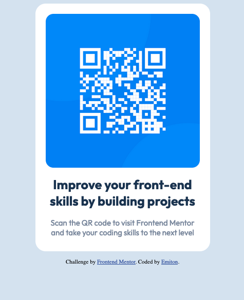

# Frontend Mentor - QR code component solution

This is a solution to the [QR code component challenge on Frontend Mentor](https://www.frontendmentor.io/challenges/qr-code-component-iux_sIO_H). Frontend Mentor challenges help you improve your coding skills by building realistic projects. 

## Table of contents

- [Overview](#overview)
  - [Screenshot](#screenshot)
  - [Links](#links)
- [My process](#my-process)
  - [Built with](#built-with)
  - [What I learned](#what-i-learned)
  - [Continued development](#continued-development)
  - [Useful resources](#useful-resources)
- [Author](#author)
- [Acknowledgments](#acknowledgments)

**Note: Delete this note and update the table of contents based on what sections you keep.**

## Overview

### Screenshot



### Links

- Solution URL: [Add solution URL here](https://your-solution-url.com)
- Live Site URL: [Add live site URL here](https://your-live-site-url.com)

## My process

### Built with

- Semantic HTML5 markup
- Flexbox
- Mobile-first workflow

### What I learned

This project allowed me to experiment with the basics of flexbox. Using minimal knowledge of flexbox, I was able to properly align the items within the flex container.


```css
.card {
  margin: auto;
  margin-bottom: 15px;
  display: flex;
  flex-direction: column;
  align-items: center;
  width: 300px;
  background-color: hsl(0, 0%, 100%);
  padding: 20px;
  border-radius: 20px;
  padding-bottom: 15px;
}
```


### Continued development

I would like to use flexbox in a more complex project. Additionally, I need to spend some time looking into CSS properties and their common use cases. I have an understanding of the fundamentals, but my intuition still needs to be developed.

- Website - [Emiton](https://www.emiton.io/)